## RETO UX 2
** 1. Identifica los elementos de navegación en los siguientes sites **

### Breather

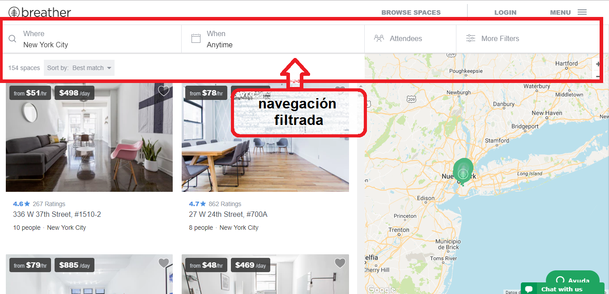
--------------------------------------------------------------------------------------------------------------------------------------

--------------------------------------------------------------------------------------------------------------------------------------
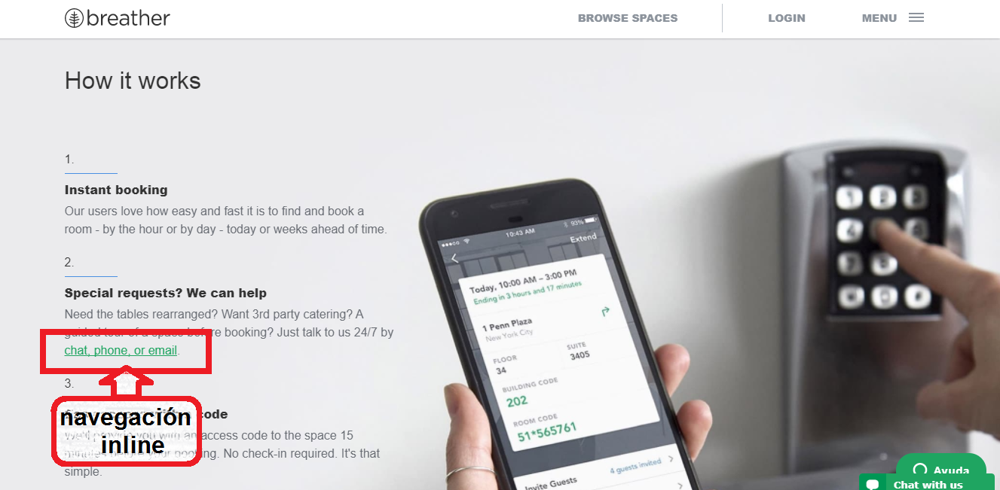
--------------------------------------------------------------------------------------------------------------------------------------
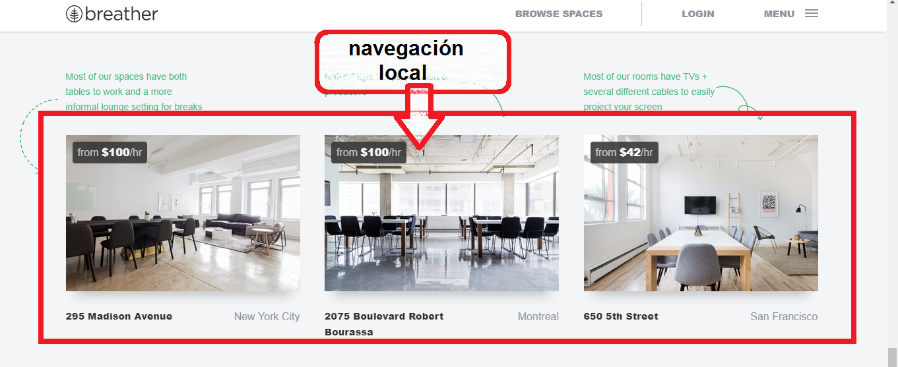
--------------------------------------------------------------------------------------------------------------------------------------
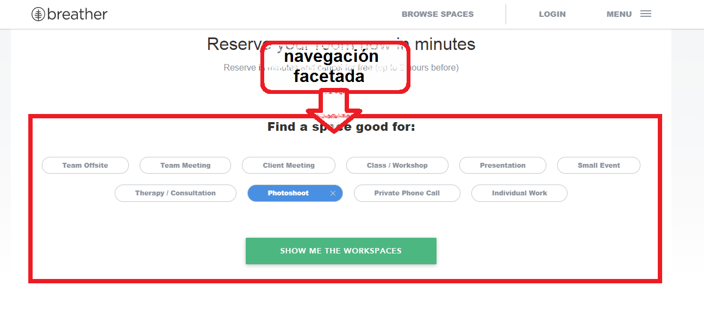
--------------------------------------------------------------------------------------------------------------------------------------

### Github

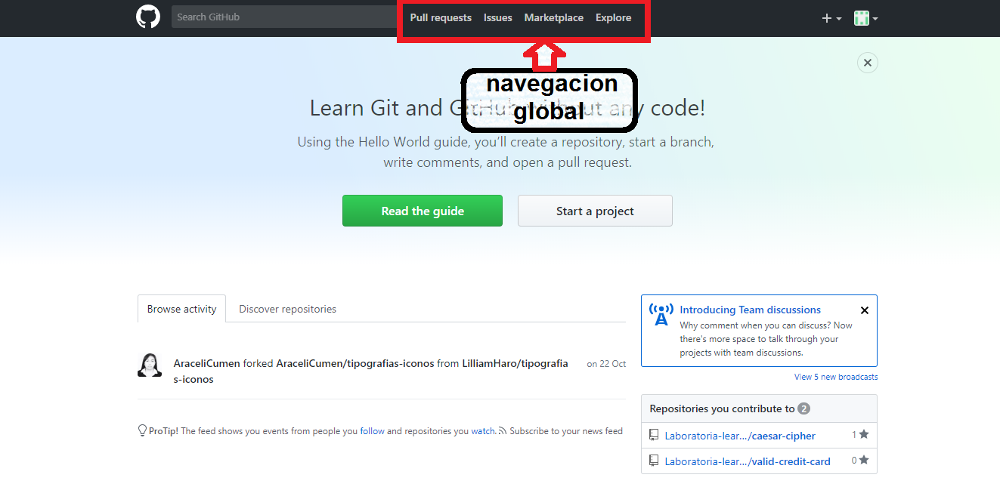
--------------------------------------------------------------------------------------------------------------------------------------
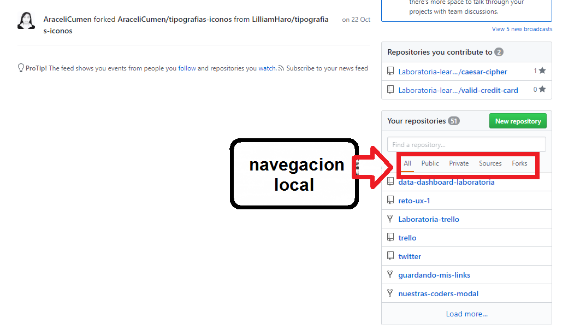
--------------------------------------------------------------------------------------------------------------------------------------
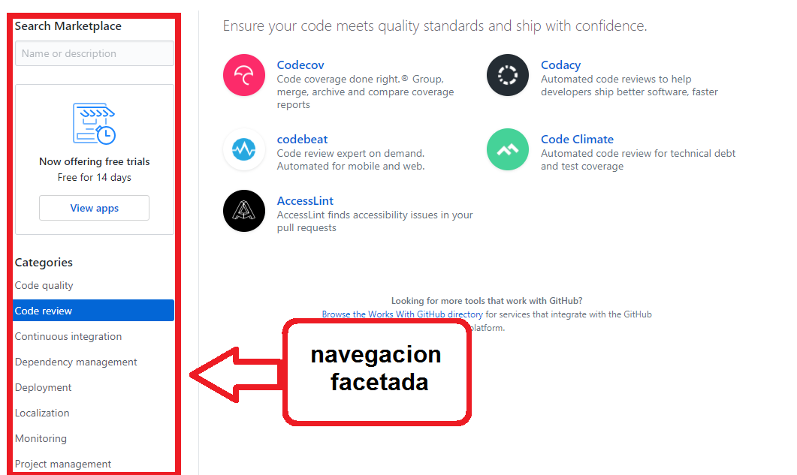
--------------------------------------------------------------------------------------------------------------------------------------
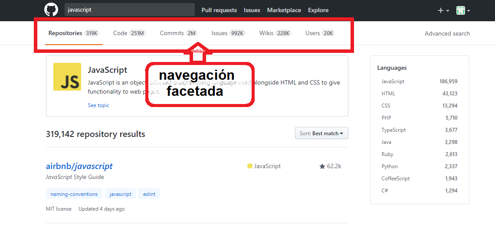
--------------------------------------------------------------------------------------------------------------------------------------
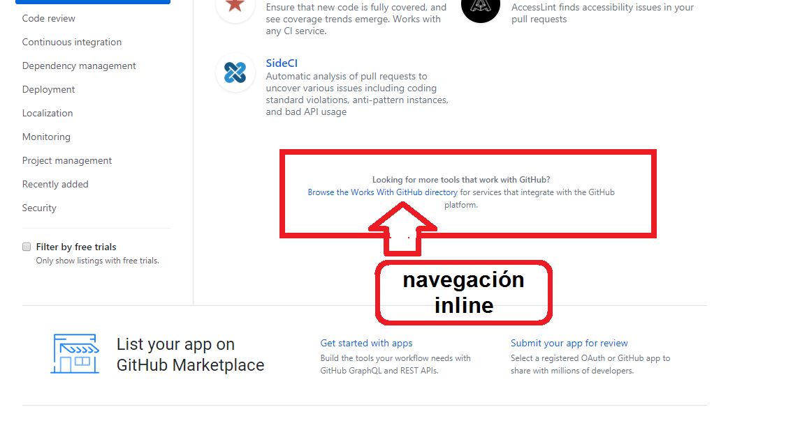
--------------------------------------------------------------------------------------------------------------------------------------

### Medium

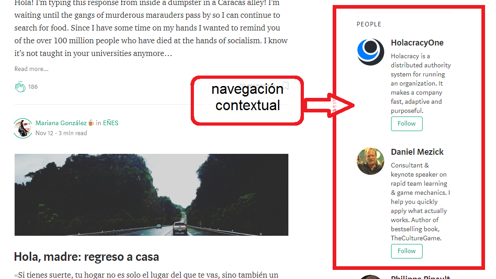
--------------------------------------------------------------------------------------------------------------------------------------
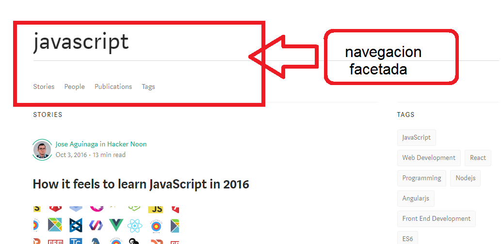
--------------------------------------------------------------------------------------------------------------------------------------
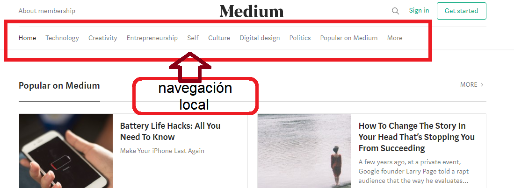
--------------------------------------------------------------------------------------------------------------------------------------
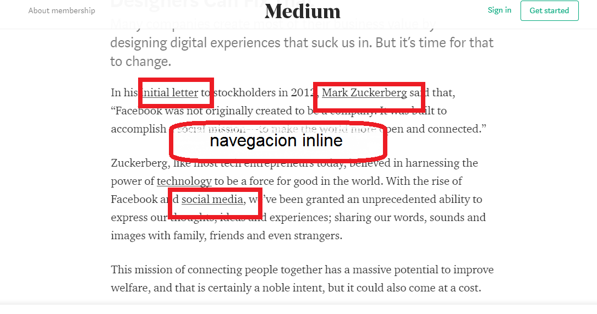
--------------------------------------------------------------------------------------------------------------------------------------
